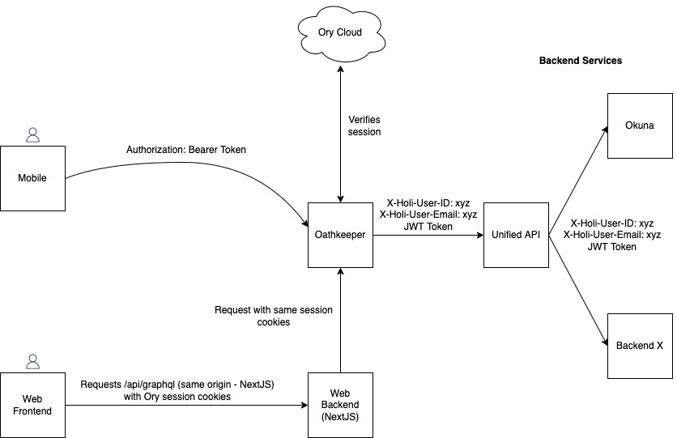

# Authentication & Authorization

HOLI uses [Ory Cloud](https://www.ory.sh/cloud/) as identity provider. Ory Cloud is a SaaS version of [Ory Kratos](https://www.ory.sh/kratos/)
and contains e.g. a database of users, APIs for registering, logging in & out, resetting passwords, etc.

HOLIs architecture relies on [Ory Oathkeeper](https://www.ory.sh/oathkeeper/) (a zero-trust reverse proxy) which ensures that all requests
towards a backend service / HOLIs GraphQL API are either

- authenticated (the request was made from a user with a valid account & session), or
- anonymous

Authentication works differently for mobile and web:

- **Mobile:** the session token are stored within a [SecureStore](https://docs.expo.dev/versions/v45.0.0/sdk/securestore/) after the user
  successfully logged in. When sending requests to the backend, the session token `$TOKEN` is attached to the requests using an HTTP header:
  `Authorization: Bearer $TOKEN`.
- **Web:** the session token is stored within the user's browser as an HTTP-only secure cookie (which is not readable from JavaScript and
  thereby "secure"). The browser automatically includes the Cookie in every request sent to our NextJS api endpoint `/api/graphql`, which in
  turn forwards the request with the same Cookie to our unified api, going through Oathkeeper first.
  Please note: the cookie has domain-wide validity (i.e. every request to every subdomain of `holi.social` will include this cookie).
- Anonymous requests must not include an `Authorization` header, nor an Ory session cookie. Requests containing either of the two with
  invalid data will fail.

Upon receiving a request

- containing either `Authorization` header or an Ory session cookie, Oathkeeper will validate the user's session with Ory Cloud and forward
  it to the configured backend service. The request to the backend service will have the request headers `X-Holi-User-ID` and
  `X-Holi-User-Email` set to allow a backend system to identify the current requests user identity. Alternatively, Oathkeeper can be
  configured to issue JWT tokens instead of attaching request headers.
- containing neither an `Authorization` header, nor an Ory session cookie, Oathkeeper will forward the request to the configured backend
  services with the request headers `X-Holi-User-ID: anonymous` and `X-Holi-User-Email: anonymous`.

---

:::info Networking Security
To enforce security within the backend realm, all backend services are contained within a virtual private network on Google Cloud.
Networking rules ensure that traffic may only enter via the Oathkeeper service. An additional layer of security can be achieved by
using JWT tokens instead of relying on X-Holi-User-ID / X-Holi-User-Emailheaders (currently not implemented but planned).
:::
