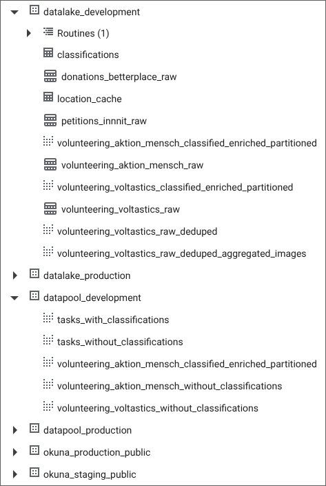
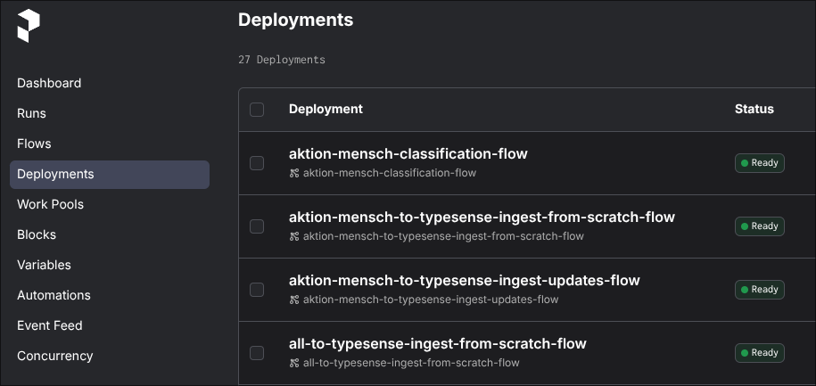
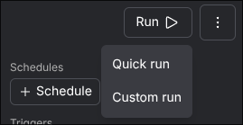
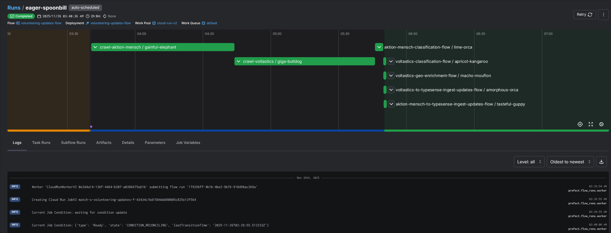
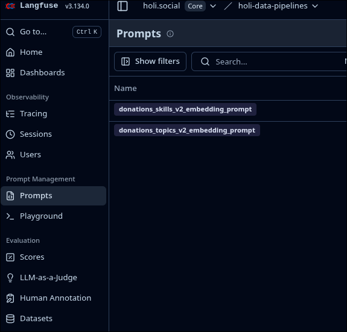
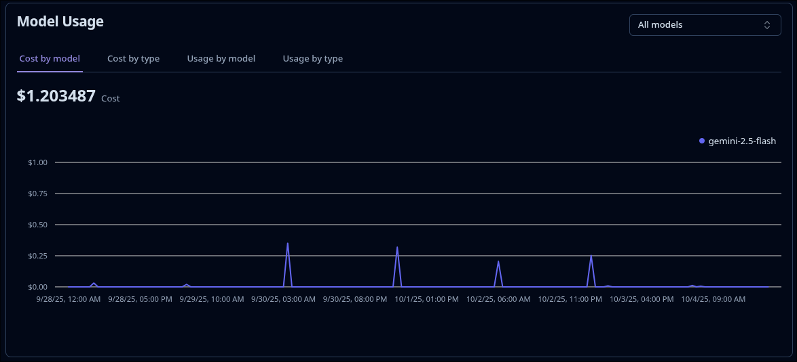

# Data pipelines

import Drawio from "@theme/Drawio";
import DataPipelinesDrawio from "!!raw-loader!../img/data-pipelines.drawio";

holi uses [Typesense](./typesense.mdx) to provide a uniform query API for data from different sources:

- External data:
  - Donations
  - Volunteering engagements
  - Petitions
- Data from Okuna:
  - Spaces
  - Public tasks
  - User profiles
- Document [enrichments](#enrichments) to facilitate search and provide user specific recommendations:
  - classifications (topics, skills, commitment, duration)
  - location (coordinates, remoteness)
  - text embedding for textual queries
  - embeddings for sorting documents (topics & skills, similarity)

In order to retrieve, enrich, transform and transfer all this data to typesense, we use several data pipelines:

- [Crawlers](#crawlers) to retrieve data from external sources
- [Data stream and events from Okuna](#okuna-data-stream-and-events) to synchronize Okuna data via [BigQuery](https://cloud.google.com/bigquery) and [PubSub](https://docs.cloud.google.com/pubsub/docs/overview)
- [Ingestion pipelines](#ingestion-pipelines) for initial ingestion and schema changes
- [Update jobs](#update-jobs) to process updates of external data
- [Cloud function](#cloud-function-to-process-events) to process events from PubSub topics
- [Quality checks](#quality-checks) to alert on pipeline issues

:::info
Our pipelines grew in complexity over time with different issues, leading to the introduction of a "new" event and cache based approach vs. the "old" hybrid approach based on complex table joins in BigQuery. Currently the "new" approach is only implemented for donations. Ideally all future and existing pipelines should be built to follow the "new" approach. See [the comparison](#old-vs-new-approach) for more details and reasoning.
:::

<Drawio content={DataPipelinesDrawio} style={{ width: "100%" }} />

## Crawlers

We use external data sources to provide the following data in holi:

- Donations from [betterplace](https://www.betterplace.org/)
- Volunteering engagements from [Voltastics](https://voltastics.com/) and [Aktion Mensch](https://www.aktion-mensch.de/)
- Petitions from [innn.it](https://innn.it/)

Currently we fetch all this data by daily jobs scraping their APIs.

:::warning
The [API of betterplace](https://github.com/betterplace/betterplace_apidocs/blob/master/api_v4_readme.md#public-api) is deprecated and will be discontinued on 01.07.2026. Currently our scraper also suffers from heavy rate limiting.

We also filter donations, as we won't display completed or closed donations in the frontend anyways. This could (and initially did) happen at a later step, but as a means to circumvent the rate limiting we currently already filter while crawling.
:::

These crawlers write the raw, untransformed data to BigQuery, partitioned by crawl date (available in the special column `_PARTITIONTIME`).

:::warning
When [streaming data into partitioned BigQuery tables](https://docs.cloud.google.com/bigquery/docs/write-api#ingestion-time_partitioning), the data will not be available for [queries by partition time](https://docs.cloud.google.com/bigquery/docs/querying-partitioned-tables#query_an_ingestion-time_partitioned_table) immediately. Instead we have to wait until the streaming buffer is empty, which can take up to 90 minutes. We created a helper function `wait_for_bigquery_data_to_be_accessible` for this.
:::

Each crawler writes to their own table inside environment specific data sets called `datalake`:

- `donations_betterplace_raw`
- `volunteering_voltastics_raw`
- `volunteering_aktion_mensch_raw`
- `petitions_innnit_raw`

## Okuna data stream and events

### Data stream

We have set up a [BigQuery Data stream](https://cloud.google.com/datastream-for-bigquery) to synchronize Okuna data from PostgreSQL to BigQuery.

This includes the complete Okuna data, even though we currently do not transfer everything to Typesense. Instead our pipelines only process the following data types:

- Spaces
- Public tasks
- User profiles

### Update events

In order to react to updates in realtime, Okuna also publishes events when documents of the following types get created, updated or deleted:

- Spaces
- Tasks
- User profiles

These events are written to a PubSub topic and are processed by a [cloud function](#cloud-function-to-process-events) to forward these updates to Typesense.

## Ingestion pipelines

There are multiple ingestion pipelines to fully update the data in Typesense per data type. These pipelines are only relevant for initial ingestion of an empty Typesense instance and for schema changes or introduction of new data types and are only [triggered on demand](#prefect).

- `all_to_typesense_ingest_from_scratch`: Complete ingestion of _all_ data types that also handles schema changes. Typically this should only be necessary for [larger schema changes](#full-ingestion-of-data).
- `donation_events`: Pipeline following the ["new" event-based approach](#old-vs-new-approach):
  - This pipeline is the same one as used for [updates](#update-jobs), differentiated by different input parameters. In case of full ingestions `old_partition_date` should be kept empty, while `new_partition_date` should always be the latest crawl date. This way the complete last crawled set of donations will be processed.
  - The data is not yet enriched and written to Typesense, but instead sent as events to the `donations` PubSub topic that will be handled by the [cloud function](#cloud-function-to-process-events).
  - Ingestion is performed asynchronously: Check the state of the `pubsub-typesense-updater-donations` PubSub subscription to see the progress.
- `*_to_typesense_ingest_from_scratch`: Pipelines following the ["old" approach built around BigQuery](#old-vs-new-approach):
  - The latest state is fetched from BigQuery (both for Okuna and external data).
  - [Enrichments](#enrichments) are read and written from BigQuery
  - [Transformed documents](#common-document-schema) are written directly to Typesense
  - Ingestion is performed synchronously: Ingestion is done when the pipeline is finished.

## Update jobs

There are multiple update jobs to regularly handle updates of external data. Instead of importing the whole data set each time, we only process newly created, updated or deleted documents. These pipelines are [scheduled](#prefect) to run daily.

In all cases the pipelines start by initiating the respective [crawlers](#crawlers) and wait for the BigQuery data to be accessible.

- `donation_updates`: This pipelines follows the ["new" event-based approach](#old-vs-new-approach):
  - When starting the crawl, we keep track of the previous and current crawl date.
  - Afterwards the `donation_events` pipeline is triggered - the same one as used for [ingestion](#ingestion-pipelines). The parameters `old_partition_date` and `new_partition_date` are set to the previous resp. current crawl date.
  - The crawled states for these dates are compared and will be used to create a list of creation, update and deletion events, which are sent to the `donations` PubSub topic and will be handled by the [cloud function](#cloud-function-to-process-events).
  - The update is performed asynchronously: Check the state of the `pubsub-typesense-updater-donations` PubSub subscription to see the progress.
- `volunteering_updates`, `petitions_updates`: These pipelines follow the ["old" approach build around BigQuery](#old-vs-new-approach):
  - After the crawlers are finished, we compare the old and new crawled states inside BigQuery to only process the changes from the previous run, depending on complex `hash` calculations.
  - Additional table joins are used to identify which [enrichments](#enrichments) might have to be recalculated.
  - We iterate over all changes, enrich and [transform](#common-document-schema) the data as required and update Typesense accordingly.
  - Newly calculated enrichments are updated in BigQuery.
  - In case of volunteering we also send events for all deleted documents to the `external-data` PubSub topic so Okuna can process deletions of engagements marked as favourite by users.
  - The updates are performed synchronously: Typesense is up to date when the pipeline is finished.

## Cloud function to process events

The events sent to the [`okuna`](#update-events) and [`donations`](#update-jobs) PubSub topics are both handled by the same [cloud function](https://cloud.google.com/functions?hl=en) `pubsub_typesense_updater` (per environment).

Events are sent for different data types (donations, spaces, tasks etc) and can notify about their creation, update or deletion. See [Integration events](../integration-events.mdx) for a complete list and event structure.

Processing the events differs in how [enrichments](#enrichments) are calculated and stored:

- `donations`: The enrichments are calculated in the ["new" cache-based approach](#old-vs-new-approach):
  - New and updated donations are enriched with additional information stored in a persistent [Redis cache](https://redis.io/).
  - Caching is implemented for the most costly operation, i.e. the LLM invocations, by adding a custom `@cache` function decorator and calculates a cache key based on the function body and parameters. Therefore the value will only be recalculated when:
    - The input document changes
    - The prompt is changed
    - The model is changed
- `okuna`: The enrichments are calculated in the ["old" approach built around BigQuery](#old-vs-new-approach) and currently only apply for tasks:
  - New and updated documents are enriched with additional information stored in BigQuery. Enrichments and documents are mapped using both IDs and [complex `hash` calculations](#old-vs-new-approach).

The enriched document is then transformed into the [common Typesense document schema](#common-document-schema).

Finally the update (upsert or deletion) is transmitted Typesense.

## Quality checks

There are two daily scheduled pipelines to perform quality checks on the data pipeline processes:

- `typesense-qc`
  - This pipeline checks Typesense for completeness by comparing the documents with data from PostgreSQL (in case of Okuna data) and BigQuery (Okuna and external data). If the difference exceeds a certain tolerance threshold, an alert is created.
  - The tolerance threshold is required for the following reasons:
    - Calculation of enrichments using LLMs might fail even after multiple retries
    - There might be a delay with the data stream from PostgreSQL to BigQuery.
    - There might be a delay with processing update events from Okuna. Esp. e2e tests create and then quickly delete data afterwards regularly.
- `classification-qc`
  - Enrichments stored in Okuna (following the ["old" BigQuery based approach](#old-vs-new-approach)) are marked with a flag if LLM invocation failed multiple times. This pipeline checks if these failed classifications are within tolerance levels or creates an alert otherwise.

## Old vs. new approach

The original approach to process and enrich data grew quite complex over time and turned out to be quite error prone. While this approach is still used for Okuna and volunteering, we introduced a new, simpler approach when including donations.

:::tip
Ideally all new implementations should follow the new, event and cache based structure. The code for donations can serve as a guideline.
:::

### Issues with the initial approach

We identified the following issues with the original approach that was built around BigQuery:

- Both crawled data and enrichments are stored in BigQuery. In order to correctly map documents and enrichments while ensuring that updates to certain fields will result in recalculation of enrichments, we use a complex combination of hash calculation and table joins:
  - We use different target tables for the raw data and therefore different schemas from each crawler.
  - We also introduced some helper views to perform deduplication.
  - In BigQuery we differentiate between tables and views by organizing them in the two data sets `data lake` (for tables) and `data pool` (for views that just combine tables or other views).  
    
  - Additional complexity is introduced by the use of time based partitions.
  - Classification with LLMs can fail even after multiple retries, which is why we introduced a flag `classification_failed` to stop retries. These rows are filtered before transmitting the data to Typesense.
- In order to ensure existing enrichments can be reused during event processing in the cloud function, we have to ensure to use the same hash calculation in multiple BigQuery views and the python code for `pubsub_typesense_updater`. We can not guarantee that hash calculation will stay consistent when upgrading libraries.
- The hash calculation for volunteering engagements from Aktion Mensch is disproportionatly complex. Currently not even all fields that should cause updates in Typesense are included, as changing the hash would result in re-calculation of _all_ enrichments, even though they might not be required for any of them.
- Private tasks are filtered so they are not sent to Typesense.
- Tasks inherit the topics from their respective space.
- Currently there is not automated process to ensure enrichments are recalculated when we use a different LLM model or prompt.
- There might be larger changes required when there are schema changes - both of source data and Typesense documents, or when new fields should be included or excluded in hash calculation (in order to cause recalculation of enrichments).
- We use different data collections in BigQuery for both staging and production, even though we use the same sources for external data in both cases. Expensive LLM prompts have to executed twice to populate both environments.
- When writing data to partitioned BigQuery tables, we have to wait for the [streaming buffer](#crawlers) to be empty before the data can be queried (by the new partition). When using such tables in multiple pipeline steps, this waiting time accumulates.
- The processes for ingesting a full data set from scratch and processing updates slightly differs, even though enrichment of data happens in both steps: During ingestion we iterate over data from BigQuery directly, while updates are sent as PubSub events.

:::info
[Enrichments](#enrichments) in BigQuery started with topic and skill classifications, hence the respective tables can be recognized by the suffix `classifications`.

There is a separate table for the geolocation cache.
:::

### New approach based on event handling and caching

When introducing donations as new document type, we started with a simpler approach resolving some of the previous issues by making use of caching and using the same event-based process for ingestion of full data and updates:

- BigQuery is only used for crawled data: No complex table joins and only one step has to wait for the [BigQuery streaming buffer](#crawlers).
- Processing a full ingestion and updates follow the exact same process: Both are based on PubSub events.
- Enrichments are stored in a Redis cache. Calculation of cache keys is flexible and document specific:
  - For each field we can define exactly which input fields the enrichment depends on. Changes in other fields will not result in new cache keys. Esp. donations contain several fields with volatile data that have no impact on the actual enrichments (e.g. donation count and sum). These fields would have to be filtered when calculating hashes the "old" way.
  - Change of the LLM model or the prompt will result in new cache keys as well.
  - See [`pubsub_typesense_updater`](#cloud-function-to-process-events) for more info on the usage.
- Failed classifications do not have to be meticulously excluded in table joins, they will just be undefined.
- We use the same cache for both staging and production, i.e. existing enrichments using the same prompt, input etc. can be reused, leading to fewer costs for LLM prompts.
  - Using the same cache in the future for Okuna data would not cause a problem either, as the cache keys will differ.

However, there are also some things to consider using this new approach:

- As we depend on event processing, even the [initial ingestion](#ingestion-pipelines) is asynchronous.
- There currently is no automation for handling [schema changes](#schema-changes) in all cases.
- As the world of LLMs is evolving fastly, the models we use sometimes get deprecated, i.e. we regularly have to update the models we are currently using. Currently a change of the model will always lead to recalculating enrichments for all new and updated documents, which might not always be desirable and will result in a small spike in [model costs](#langfuse--langchain).

## Enrichments

We enhance documents with different kinds of additional information in order to enable certain queries for the frontend. Esp. external data is also labeled with holi specific terms.

- Topics and skills
  - We use an LLM (currently [Gemini 2.5 Flash](https://console.cloud.google.com/vertex-ai/publishers/google/model-garden/gemini-2.5-flash)) to classify external data (donations, volunteering) with holi specific terms for topics and skills, so all data in holi can be matched and filtered by them.
  - The LLM is prompted to assign confidence levels between `-1` and `1` for each term and the response is validated afterwards. The request is retried a couple of times if the format did not match.
  - Tasks from Okuna already possess user defined skills and inherit topics from the related space. They receive confidence level `1` for all assigned terms and `0` for all others.
  - The documents are then enriched with the following fields:
    - `topics_skills_embedding_v2`: Combined embedding vector of all topics and skills (hard-coded order)
    - `topics_v2`, `skills_v2`: List of slugs for all terms with confidence above a hard-coded threshold value
- Similarity embedding
  - External and Okuna data is enriched with embedding vectors (`similarity_embedding`) based on text content in order to query for documents similar to a currently selected one (displayed as "similar recommendations" on detail screens).
  - We use a simple, [multilingual text embedding model](https://console.cloud.google.com/vertex-ai/publishers/google/model-garden/textembedding-gecko) for this and feed it with a document type specifc hard-coded list of text fields.
- Location
  - External data with location can be enriched with geolocation coordinates (`location_lat_lng`) from [Geoapify](https://www.geoapify.com/) if they are missing.
  - In case of volunteering we also add a flag to mark remote engagements (`location_type`).
- Volunteering commitment
  - Both Okuna tasks and external volunteerings have fields for the commitment level of an engagement. However the labels of external data use different terms and first have to be matched to the holi specific list (`one-time`, `recurring`, `negotiable`) for consistent filtering and querying (inside the field `commitment_label`).
- Volunteering duration
  - While tasks already possess user defined values for the duration of the engagements, this information is missing for data from external sources.
  - We use an LLM (currently [Gemini 2.0 Flash](https://console.cloud.google.com/vertex-ai/publishers/google/model-garden/gemini-2.0-flash-001)) to estimate the duration (`commitment_duration`) from a hard-coded list of possible values (10-15 min, 1-2 hours, 1 day etc.) and also store the AI reasoning (`commitment_duration_ai_derived` and `commitment_duration_ai_reasoning`).
- Text embedding
  - When writing data to Typesense, all documents receive a Typesense generated text embedding (`embedding`) that can be used for textual queries in our search. This is configured by defining a list of text fields the embedding should be based on in the [schema definition](#common-document-schema). Currently we are using the built-in model [`ts/multilingual-e5-base`](https://huggingface.co/typesense/models-moved/tree/main/multilingual-e5-base).

## Prefect

We use [Prefect](https://www.prefect.io/) to orchestrate our data pipelines:

- [Ingestion jobs](#ingestion-pipelines)
- [Update jobs](#update-jobs) incl. [crawlers](#crawlers)
- [Quality check jobs](#quality-checks)

The data pipelines are implemented as Prefect "flows" and "tasks".

Flows can be triggered either automatically by defining schedules or manually in the Prefect UI or from the command line:

- In orer to trigger a flow from the Prefect UI, there needs to be a "deployment" defined for it (see `src/pipelines/deployments.py`)
  - Go to Prefect > "Deployments" and select the flow you want to trigger  
    
  - Select "Run" > "Quick run" for flows that don't need any parameters
  - Select "Run" > "Custom run" in order to set parameters, e.g. dates for the donation events flow
  
- Deployments can have a schedule to be run automatically: Currently update flows and quality checks are scheduled to be run on a daily basis.
- Command line: All flows can be run locally just by running the corresponding python scripts. Ensure to set up the environment correctly for this, incl. a tunnel to prefect (which should be opened by `direnv`). See the README for additional instructions.

:::info
Prefect flows are executed as [Cloud Run Jobs](https://docs.cloud.google.com/run/docs/managing/jobs).

While logs are also avaiable in the Prefect UI, they currently do not contain debug log messages. However, the logs of the resp. Cloud Run Job are complete and are usually linked at the end of Prefect logs (or can be found in the Google Cloud UI - identifiable by flow name and execution date).

:::

:::info
Some pipelines require a state, e.g. the date of the last successful run of crawler jobs. Those are stored as Prefect "variables".
:::

## Langfuse & Langchain

We use [Langfuse](https://langfuse.com/) for multiple purposes in the ["new" cache-based approach](#old-vs-new-approach):

- Version control for prompts: This way prompts can be adjusted easily and do not require a deployment. Prompts are defined in [Langchain mustache format](https://docs.langchain.com/langsmith/prompt-engineering-concepts#f-string-vs-mustache).  
  
- Tracing of prompts: Useful for debugging purposes
- Cost tracking: There is a dashboard for model usage costs as an easy way to check if costs are in an acceptable range. It can also serve as "sanity check" if the cache is working properly as costs should be proportional to the expected count of updated documents.  
  

:::warning
Note that changing the prompt will result in new cache keys for the corresponding enrichments.

Also ensure that the variables used inside the prompt template matches the input you provide.
:::

## Common document schema

Although we store different types of data in Typesense, we currently use the same [common document schema](./typesense#document-schema) for all of them as this allows us to query all of them at once in the same uniform API. See the [documentation about our Typesense usage](./typesense.mdx) for more information on this.

The current document schema is defined in two places that should be kept in sync:

- The Typesense UI: This is the one that is actually used by Typesense
- In the `holi-data-pipelines` repository in `staging_all.json` resp. `production_all.json`: These should basically be snapshots of the ones active in Typesense

There also is the [GraphQL schema defined for the unified API](./typesense#graphql-api-wrapper) which is optimized for usage by the frontend and should be aligned as well.

The section about [schema changes](#schema-changes) describes how changes should be applied.

## Schema changes

All documents in Typesense are stored in a [single collection per environment](./typesense#configuration), using the same [common document schema](#common-document-schema).

When changing the common schema for Typesense documents it is necessary to examine the extend of the update in order to decide how to handle it. The basic question to answer is:

> Will it be necessary to re-ingest all existing data?

Below we describe how to recognize and what to do in case of [minor schema changes](#minor-schema-changes) and larger changes that require a [full re-ingestion](#full-ingestion-of-data).

:::warning
When changing the common document schema, make sure to also reflect these changes in the [JSON schema for the GraphQL API wrapper](./typesense#graphql-api-wrapper) if necessary.
:::

:::warning
When adding new fields, consider the future [frontend usage](./typesense#frontend-usage) to decide if the data needs to be indexed or not.
:::

:::warning
Note that all changes to the Typesense document schema should be applied in a backwards compatible way to not break the frontend API for older client versions.
:::

### Minor schema changes

Typesense schema changes are only minor when e.g.

- All new columns are optional and are only relevant for data yet to be written to Typesense
- An optional, unused column is removed

In these cases you can apply the schema change ad-hoc and manually:

- Checkout the Typesense documentation on how to apply [manual schema updates](./typesense#manual-schema-updates)
- Update the schema in the `holi-data-pipelines` repository: `staging_all.json` or `production_all.json`
  - This step is not necessary right away but ensures the schema is kept in sync for future changes.

The new schema is available for querying and writing after a few moments.

When adding a new data source, [trigger](#prefect) the respective job to [ingest data from scratch](#ingestion-pipelines).

### Full ingestion of data

A full (re-)ingestion of data might be necessary when e.g.

- Adding new column that should be filled for existing data as well
- An existing column is marked as indexable or facetable (i.e. a column that was not available for querying before should now be added to the query index)

The first step is to update the schema in `staging_all.json` resp. `production_all.json`.

While it would be possible to now manually update the schema as for [minor schema changes](#minor-schema-changes) and [trigger](#prefect) the [ingest pipelines](#ingestion-pipelines) for all single data types individually, it is more convenient and safer to use the utiliy pipeline `all_to_typesense_ingest_from_scratch` instead. This pipeline handles all data types and the schema change will only be fully applied when all ingestions were successful.

This pipeline `all_to_typesense_ingest_from_scratch` performs the following steps:

- It creates a new Typesense collection using the new schema (defined in `staging_all.json` resp. `production_all.json`)
- Triggers the ingestion pipelines for all data types
- If all pipelines were successful:
  - The new collection is set as new "active" collection in Typesense by overriding the resp. [collection alias](./typesense#configuration)
  - The old collection is deleted
- In case of errors:
  - The old collection is continued to be used
  - The current state of the broken, new collection is still available for debugging purposes and should be deleted manually once it's not needed anymore

:::warning
If [update events](#cloud-function-to-process-events) are still processed while a full ingestion is taking place, the updates will only be applied to the _old_ collection. In order to prevent any kind of data loss it is necessary to halt processing updates by the cloud function during this time.

Currently this requires to manually "halt" the `pubsub_typesense_updater` cloud function, e.g. by reducing the instance count in the Terraform configuration to 0.

It might be a future improvement to automate this.

Note that halting the processing of events will likely trigger an alert when the amount of unacknowledged messages accumulates.
:::

:::info
The ["new" event-based approach](#old-vs-new-approach) is asynchronous, i.e. the state of the PubSub subscription has to be watched to get information on the current progress.

The events won't be processed while the cloud function is halted (see above).
:::

:::info
The different collections in Typesense can be recognized by timestamp suffixes of their creation date.
:::

TODO: reference in architecture, mark machine learning docs as outdated (or remove)
