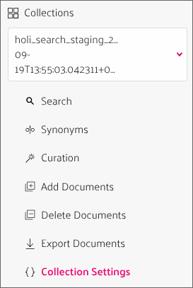
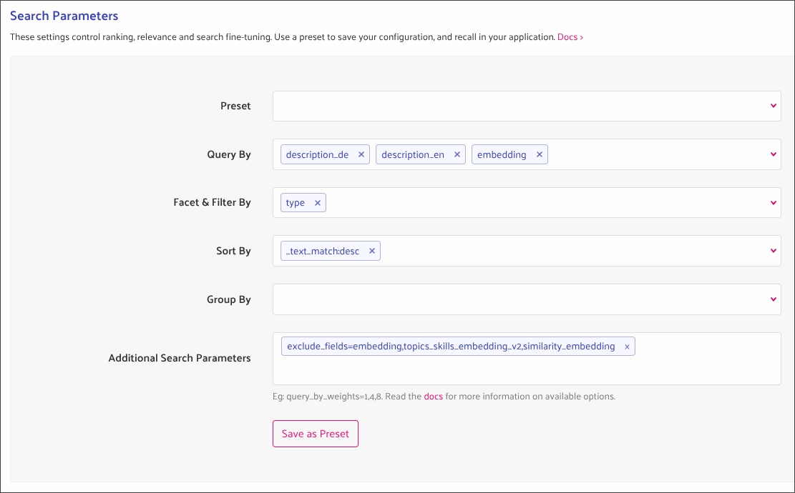
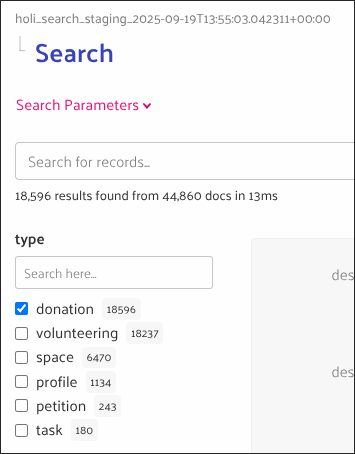

# Typesense

We use [Typesense](https://typesense.org/) as search engine for various data inside holi:

- Text search for spaces, volunteering engagements (space tasks and external opportunities) and profiles
- Fetching volunteering engagements, donations and petitions (user-specific and similarity recommendations, filtering, detail views)

Typesense is filled with documents by complex [data pipelines](./index.mdx) that fetch, enrich and combine data from various sources.

In order to unify and simplify frontend usage, we do not directly make requests to Typesense from the frontends, but created [wrappers in our unified GraphQL API](#graphql-api-wrapper) instead.

## Configuration

We currently only operate a single [Typesense cluster](https://cloud.typesense.org/clusters/t9vemwkibxajcorqp/cluster-configuration) for both staging and production.

However, we use separate [collections](https://cloud.typesense.org/clusters/t9vemwkibxajcorqp/collections) for the two environments that contain documents of all different types.

During [schema migrations](./#schema-changes) with larger changes, we create new clusters that will replace the current one eventually. In order to provide a stable collection name to be used in the frontend, we defined an [alias](https://cloud.typesense.org/clusters/t9vemwkibxajcorqp/aliases) per environment pointing to the currently active collection.

:::info
Currently there are still some more clusters defined that were used for prototypes.
:::

### Manual schema updates

Manual schema updates for smaller changes can be applied per collection in "Collection settings":

- Select the collection to change (`holi_search_staging_${date}` or `holi_search_production_${date}`)
- Select `Collection Settings` > `Update Schema`  

- Input the [update describing the schema changes](https://typesense.org/docs/29.0/api/collections.html#update-or-alter-a-collection)
- Apply the update (this may take a moment)

### Querying in the Typesense UI

It can be helpful to directly query Typesense collections during development or debugging:

- Go to [Collections](https://cloud.typesense.org/clusters/t9vemwkibxajcorqp/collections) > Select the collection you want to query > Search
- On the top of the page you can see the paginated list of results
- Scroll down to the "Search parameters"
- Adjust the query as you need, e.g. it is often helpful to "facet" by `type`  
  
- Scroll up again to see the updated result lists
- When faceting you will also see a list of the different values on the side that you can use as filters  
  

## GraphQL API wrapper

We have two use cases when querying data from Typesense:

- [Fetching a single document by ID](#fetching-single-documents)
- [Fetching paginated lists of documents](#fetching-paginated-documents) by one or multiple search queries

For each of these use cases we provide a special query in our [unified GraphQL API](../graphql/index.mdx) that acts as a wrapper around the actual Typesense endpoints. These endpoints are defined inside the GraphQL mesh configuration and by providing a [JSON schema definition](#document-schema) for the types.

To simplify frontend usage we also introduced helper hooks.

:::warning
The JSON schema defined for the GraphQL wrapper has to be kept in sync with the [schema created by the data pipelines](./#schema-changes)!

It might also have to be updated in case of Typesense API changes.
:::

### Fetching single documents

In order to fetch a single document by its ID we provide the GraphQL query [`documentById`](../graphql/operations/queries/typesense-document-by-id) as a wrapper to the [Typesense document search endpoint](https://typesense.org/docs/27.1/api/search.html):

- The query expects two parameters: The document ID and [type](../graphql/types/enums/typesense-document-type)
- The wrapper builds a fixed query:
  - Usage of the correct Typesense endpoint, API key and collection
  - Filtering by the combined Typesense ID `${document_type}_${id}` (We prefix all IDs in with the type as we use a single collection for all document types)
  - Filtering by the document type
  - Restricting the number of results to `1`
  - Excluding [non-relevant embeddings](#document-schema) from the result

Typesense does not provide an endpoint to fetch a single document as it only handles lists, so even this query will return a list result, even though it contains at most one document.

In the frontend we provide the helper hook `useSingleTypesenseDocumentQuery` that extracts the single document from the result list, or calls a provided `onNotFound` callback to handle the case that no result was found.

### Fetching paginated documents

Typesense provides an [endpoint to search by multiple queries](https://typesense.org/docs/27.1/api/federated-multi-search.html) at once (in addition to the ["simple" search endpoint](https://typesense.org/docs/27.1/api/search.html) that only executes one query).

We do not make full use of this yet in the frontend, except for fetching facet counts to display the number of expected results when filtering. I.e. in most cases we currently only provide a list containing only a single query, but we are already prepared for more complex use cases.

In contrast to the [single document query](#fetching-single-documents) the GraphQL wrapper query [`multiSearch`](../graphql/operations/queries/typesense-multi-search) for multiple documents is rather simple:

- The endpoint expects a list of [search queries as input](../graphql/types/inputs/typesense-search-params-input) that are forwarded without changes
  - See the [Typesense documentation](https://typesense.org/docs/27.1/api/search.html#search-parameters) for the full list and description of all possible query parameters.
- The endpoint ensures usage of the correct Typesense endpoint, API key and collection

As we mostly use single search queries, we offer two helper hooks in the frontend:

- `useTypesensePaginationMultiQuery`: Handles a list of search queries and results
- `useTypesensePaginationQuery`: Wrapper for `useTypesensePaginationMultiQuery` handling only a single search query and result list

:::info
In order to properly handle caching for paginated data in the format Typesense provides, we defined a [custom cache policy](../caching/apollo-client-caching#cache-policy-for-typesense-data).
:::

## Frontend usage

We have different use cases in the frontend to fetch data from Typesense with different queries:

- Search by text query `q`
  - This is currently only used for the search of spaces, volunteering opportunities (types volunteering and task) and user profiles, but would in general be possible for all data types.
  - This query makes use of the Typesense generated field [`embedding`](./#enrichments)
- Filter by document type or other fields
  - Used for the global search (type and location)
  - Use for filtering volunteering engagements (incl. micro actions) and donations by location, topics, skills etc.
    - In order to display the number of expected results next to filter options, we perform extra queries to fetch "facet counts"
- Recommendations
  - We build a `topics_skills_embedding_v2` embedding vector matching the currently logged in user
    - `1` for all interests and skills they selected in their profile, `0` otherwise
    - Using a hard-coded list of topics as fallback if necessary
  - We then query for the 100 nearest neighbors, sorted by distance to the user embedding
  - If also takes the user location into account, if available
- Similar recommendations
  - On details screens for external volunteering opportunities and tasks we display a list of other volunteering engagements that are similar to the currently selected one by comparing their `similarity_embedding` vectors
- Single document query
  - Currently we only make use of Typesense for the details screens of external volunteering opportunities and donations.
  - For holi internal data (spaces, tasks, profiles) we continue to use Okuna

:::warning
In order to query or filter by fields, they need to be indexed. This is done by either setting the `index` or `facet` [parameter](https://typesense.org/docs/29.0/api/collections.html#field-parameters) to `true`.

Using a field as ["facet"](https://typesense.org/docs/29.0/api/search.html#facet-results) can make sense if the values are numerical or the list of different values is limited (e.g. document type (`type`) or volunteering commitment (`commitment_label`)) and if you want to display result counts for the different values in the frontend. It can also be used for list fields (e.g. `topics_v2`).

Changing a non-indexed field to be indexed at a later point in time is a [schema change](./#schema-changes) and will require re-ingestion of the related documents.
:::

:::info
Currently the frontend does not yet make use of all enrichments for donations (e.g. for filtering or similarity recommendations), but the necessary data for this would already be available.
:::

### Handling localization

Some external data sources offer localized texts, e.g. [betterplace](https://betterplace.org/) allows users to define translated texts for donations. To handle this our [common document schema](#document-schema) provides fields for all languages our frontend offers, i.e. currently English and German.

In order to simplify frontend usage, we provide the helper function `localizeTypesenseDocument` to pick the correct fields for the current user:

- The function expects two parameters:
  - The user's language, determined e.g. using `useUserLanguage`
  - The Typesense document to localize
- The function transforms the document to the simplified type `LocalizedTypesenseDocument`:
  - All variants of language specific fields are removed and replaced by the one matching the user's language without language suffix
  - E.g. `title_de` and `title_en` are replaced by a simple `title`
  - If the field matching the user's language is missing content, we use the other one as fallback.

## Document schema

Currently we use the same common schema for all document types:

- `id`: In order to prevent ID collisions, all holi IDs are prefixed with the type, e.g. `donation_123` or `space_234`
- `type`: Can be `donation`, `volunteering`, `petition`, `space`, `task`, `profile`
- Text fields
  - Text fields can be provided in all languages the frontend offers (currently DE and EN)
  - The different variants are written to separate fields, differentiated by respective suffixes, e.g. `title_de`, `title_en`, `description_de`, `description_en` etc.
  - We provide a [helper function](#handling-localization) to handle these localized fields in the frontend
- `location_lat_lng`: Optional coordinates for a location, stored as array containing latitude and longitude.
- `link_locators`
  - Object containing the necessary information to build URLs in the frontend.
  - E.g. `{ donation: '123' }` for donations: Will result in `/donations/123`
  - Can be more complex for nested types, e.g. `{ task: '234', space: 'some-space' }` for tasks: Will result in `/spaces/some-space/tasks/234`
- Type specific fields
  - Some fields are only defined for specific types, e.g. `user_full_name` for user profiles, or `donation_open_amount_in_cents` for donations.
  - By convention these fields should be prefixed by the type name.
- Labels
  - `topics_v2`, `skills_v2`: Allows filtering by topics and skills
  - `location_type`: Remote or on-site
  - `commitment_label`, `commitment_duration`: Volunteering and task specific labels. There are also fields with information about the "AI reasoning".
- [Embeddings](index.mdx#enrichments)
  - `embedding`: Typesense generated text embedding - available for all documents
  - `topics_skills_embedding_v2`: Embedding for filtering and sorting by user interests and skills - available for tasks, volunteering and donations
  - `similarity_embedding`: Embedding for querying similar documents - available for tasks, volunteering and donations
  - These fields are only relevant for querying and are typically excluded when fetching data from the frontend. This is taken care of by the [helper hooks for multi queries](#fetching-paginated-documents) resp. the [GraphQL wrapper for the single document query](#fetching-single-documents).

:::warning
The [document schema](/graphql/types/objects/typesense-document) used by the [GraphQL API wrapper](#graphql-api-wrapper) is defined as JSON schema in the unified-api repository and should be kept in sync with [schema changes](./#schema-changes).
:::
