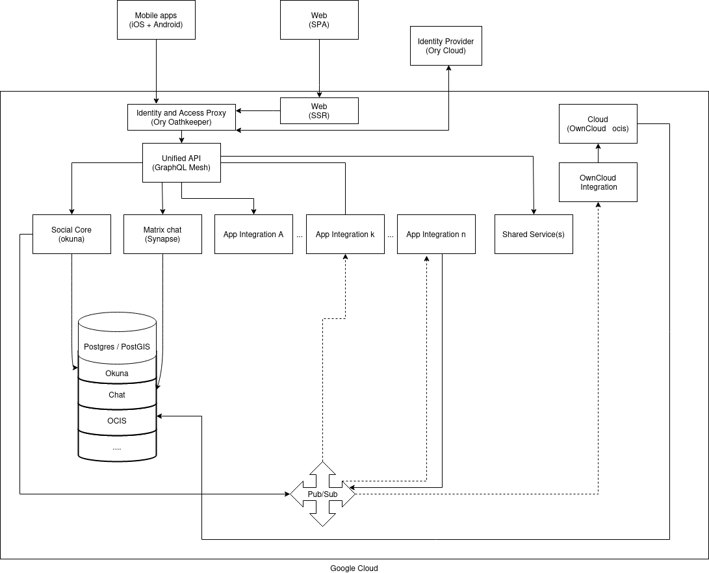

# Runtime Architecture

This section describes the runtime architecture of holi. Let's start with a (simplified) diagram, and then dive into some details:

## Frontends

The Web Frontend and the Mobile Apps work a little bit different from each other.

The Mobile Apps directly connect to the Unified API for fetching data. For authenticating users, they directly interact
with our Identity Provider, [Ory](https://ory.sh).

The Web App proxies requests to the Unified API and to Ory through a server component, which also handles Server Side
Rendering (Web SSR in the diagram).

## Identity Provider

We are using an external service, [Ory](https://ory.sh), as Identity Provider.

## Services

Most services are completely hidden from the clients and only accessible via the Unified API. There is some services like
Cloud, Chat, Video Calls that are accessible from Clients because they need to be for proper function. This is not
accurately portrayed in the diagram.

## Google Cloud

Almost all our services/infrastructure run in the Google Cloud.

### Pub/Sub

As an asynchronous data exchange & replication mechanism, some backend services communicate with one another via the Google Pub/Sub message queue.

